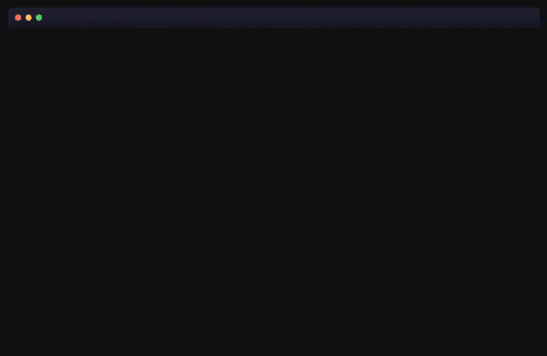

<div align="center">


# frisk

**frisk it before you clone it.**

A free, no-login security scanner for any public GitHub repository. Check any repo for leaked secrets, malware, malicious packages and vulnerable dependencies before you clone or run it, straight from the URL and without cloning. Live at **[friskit.dev](https://friskit.dev)**.

[](https://friskit.dev)
[](LICENSE)

<br>

<a href="https://friskit.dev"></a>

</div>

## Use it

Swap the domain on any GitHub repo:

```
github.com/owner/repo   →   friskit.dev/owner/repo
```

Or paste a repo at [friskit.dev](https://friskit.dev). You get a report in seconds (instant if it was scanned recently). frisk does not retain your source, though it caches the report, which includes short snippets of the lines it flagged. Detected GitHub, Slack, Stripe and npm tokens are checked against their provider to see if they are live, committed binary hashes go to VirusTotal, and dependency names to OSV.

## What it checks

- **Secrets** committed to the repo: API keys, tokens and private keys. GitHub, Slack, Stripe and npm tokens are checked against their provider to see if they are still live.
- **Malicious code**: obfuscated eval, shellcode blobs, curl piped to shell, credential and wallet stealers.
- **Supply chain**: confirmed-malicious packages (OSSF malicious-packages), typosquats, and vulnerable dependencies via [OSV](https://osv.dev) across npm, PyPI, Go and Cargo.
- **Bad binaries**: executables hashed and checked on [VirusTotal](https://www.virustotal.com).
- **Infrastructure**: Dockerfile, compose, Terraform, Kubernetes and GitHub Actions misconfigurations.
- **Repo health**: [OpenSSF Scorecard](https://securityscorecards.dev) signals, with a CycloneDX SBOM at `/api/sbom/owner/repo`.

## Reading the results

frisk is a first pass. Findings are heuristic, so read them and check before you act on them.

One thing that surprises people: **security tools come back critical when you scan them, including frisk itself.** A scanner's own source and tests are full of the exact things it hunts for, obfuscated eval, fake API keys, malware keywords like MetaMask or wallet.dat, because those are the detection rules and the test fixtures. So pointing frisk at frisk reports critical. The rules are matching the rules, and frisk is fine. The same happens with any antivirus, linter or scanner.

Every finding is a flag to investigate. Open the file, look at the line, and decide for yourself. Use frisk to find what is worth a closer look, then actually look.

## Run your own

<details>
<summary>Self host on Cloudflare Workers</summary>

```sh
npm install

wrangler kv namespace create SCAN_CACHE   # paste each id into wrangler.toml
wrangler kv namespace create VT_CACHE
wrangler kv namespace create RATELIMIT

wrangler secret put GITHUB_TOKEN          # public repo read
wrangler secret put VT_API_KEY            # free VirusTotal key

npm run deploy
```

`npm run dev` runs it locally, `npm test` runs the tests.

`npm run regression` scans a corpus of known-clean popular repos and known-bad controls (`test/corpus.json`) against the live deploy and fails if a clean repo ever produces a heuristic high or critical finding, or a control stops firing. Run it after any rule change. Add `--fresh` to bust the cache and re-scan from scratch.

</details>

## Licence

MIT, by [Fletcher Holt](https://github.com/fletcherholt).
